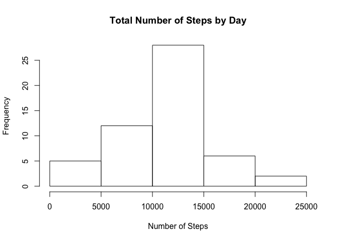
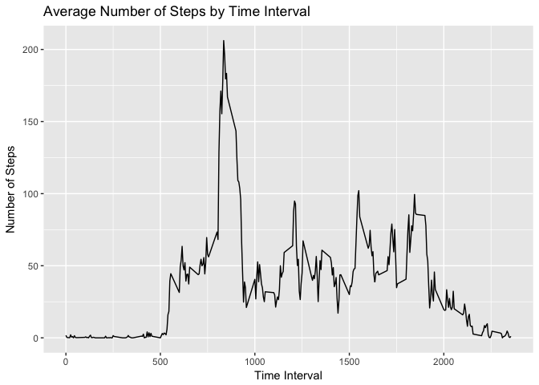
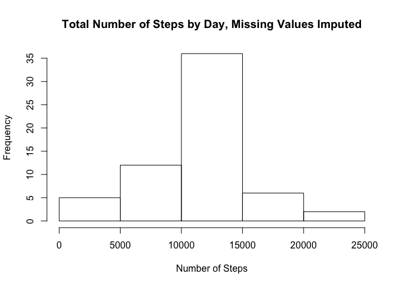
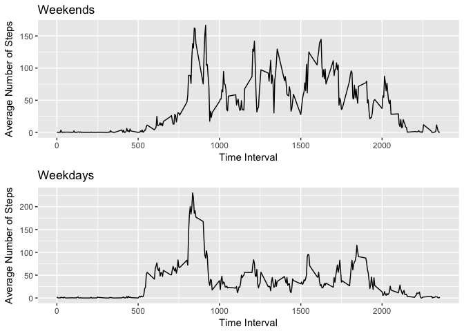

# Reproducible Research - Peer Assessment 1
Tim Parkins  
2017-03-06  


## Introduction  

This assignment makes use of data from a personal activity monitoring device. This device collects data at 5 minute intervals through out the day. The data consists of two months of data from an anonymous individual collected during the months of October and November, 2012 and include the number of steps taken in 5 minute intervals each day.

NOTE: to properly view this output in GitHub, you need to look at the .md file, rather than the .Rmd file. GitHub does not embed the images properly in the .Rmd. 

## Data  

The data for this assignment can be downloaded from the course web site:

 - *Dataset:* [Activity monitoring data](https://d396qusza40orc.cloudfront.net/repdata%2Fdata%2Factivity.zip) [52K]  


The variables included in this dataset are:

- steps: Number of steps taking in a 5-minute interval (missing values are coded as NA)

- date: The date on which the measurement was taken in YYYY-MM-DD format

- interval: Identifier for the 5-minute interval in which measurement was taken

The dataset is stored in a comma-separated-value (CSV) file and there are a total of 17,568 observations in this dataset.


## Load and prepare the data  
Assumes that the zip file, named "activity.zip" is present in the current working directory.   


```r
unzip("activity.zip")
    
activity <- read.csv("activity.csv", header=TRUE)
activity$date <- as.Date(activity$date, format="%Y-%m-%d")
```

## What is mean total number of steps taken per day?
We will summarize the total number of steps taken each day, and then display this
data in a histogram. Note that for this part of the exercise we are ignoring missing values. 


```r
library(dplyr)
```

```
## 
## Attaching package: 'dplyr'
```

```
## The following objects are masked from 'package:stats':
## 
##     filter, lag
```

```
## The following objects are masked from 'package:base':
## 
##     intersect, setdiff, setequal, union
```

```r
# summarize the data by day
df <- activity %>%
 		group_by(date)%>%
 		summarise (TotalSteps = sum(steps))

# make histogram of results
hist(df$TotalSteps, main = "Total Number of Steps by Day", ylab = "Frequency", xlab = "Number of Steps")
```

<!-- -->

Next we calculate the mean number of steps taken daily, ignoring days with missing values.  

```r
mean(df$TotalSteps,na.rm=TRUE)
```

```
## [1] 10766.19
```
Now we calculate the median number of daily steps, again ignoring days with missing values.

```r
median(df$TotalSteps,na.rm=TRUE)
```

```
## [1] 10765
```


## What is the average daily activity pattern?
We will now examine a time plot of the average number of steps taken during each 5 minute interval, ignoring missing values. 


```r
library(ggplot2)
df2 <- activity %>%
      group_by(interval) %>%
      summarise(MeanSteps=mean(steps, na.rm=TRUE))
qplot(x=df2$interval,y=df2$MeanSteps, geom="line", xlab="Time Interval", ylab="Number of Steps", main="Average Number of Steps by Time Interval")
```

<!-- -->

The time interval which has the highest average number of steps is
835 and that average number of steps is 
206.2


## Imputing missing values
There are a number of intervals for which we do not have the number of steps recorded. There are 2304 such intervals missing values.


```r
# show the code that was used above to calculate the number of missing values
sum(!complete.cases(activity))
```

```
## [1] 2304
```

It would seem that a reasonable strategy for imputing the missing values would be to populate any missing value with the average number of steps for that particular time interval. This is done below; note that this requires the 'zoo' package. 

```r
library(zoo)
```

```
## 
## Attaching package: 'zoo'
```

```
## The following objects are masked from 'package:base':
## 
##     as.Date, as.Date.numeric
```

```r
# create new dataframe with the NA values imputed
activity_complete <- activity
activity_complete$steps <- na.aggregate(activity_complete$steps,activity_complete$interval)

#summarise the data by day
df3 <- activity_complete %>%
 		group_by(date)%>%
 		summarise (TotalSteps = sum(steps))

# make histogram of results
hist(df3$TotalSteps, main = "Total Number of Steps by Day, Missing Values Imputed", ylab = "Frequency", xlab = "Number of Steps")
```

<!-- -->

Next we calculate the mean number of steps taken daily, using the new dataframe with imputed values where data was missing. 

```r
mean(df3$TotalSteps)
```

```
## [1] 10766.19
```
Now we calculate the median number of daily steps, again using the new dataframe with imputed values where data was missing. 

```r
median(df3$TotalSteps)
```

```
## [1] 10766.19
```
We note that the mean stays exactly the same after having imputed the missing values, but that there has been a slight increase in the mdedian. We also note that the impact to the estimated total of daily steps increases right in the middle of the histogram, which is not surprising since we used the median to impute. 


## Are there differences in activity patterns between weekdays and weekends?
Now we will examine if there is a noticeable difference between activity on the weekend versus activity during the week. Note that creating the plots requires the 'gridExtra' package. 


```r
# add factor variable indicating whether or not record is for a weekday
weekend <- c("Saturday", "Sunday") 
activity_complete$weekday <- factor(!weekdays(activity_complete$date) %in% weekend, levels = c(FALSE, TRUE))

# split the data out into a dataframe for weekends, and one for weekdays
wknd_activity <- activity_complete %>%
                        filter(weekday==FALSE) %>%
                        group_by(interval) %>%
                        summarise(MeanSteps = mean(steps)) 
wkday_activity <- activity_complete %>%
                        filter(weekday==TRUE) %>%
                        group_by(interval) %>%
                        summarise(MeanSteps = mean(steps))

# now create the plots
library(gridExtra)
```

```
## 
## Attaching package: 'gridExtra'
```

```
## The following object is masked from 'package:dplyr':
## 
##     combine
```

```r
plot1 <- qplot(x=wknd_activity$interval,y=wknd_activity$MeanSteps, geom="line", xlab="Time Interval", ylab="Average Number of Steps", main="Weekends")
plot2 <- qplot(x=wkday_activity$interval,y=wkday_activity$MeanSteps, geom="line", xlab="Time Interval", ylab="Average Number of Steps", main="Weekdays")
grid.arrange(plot1, plot2, nrow=2)
```

<!-- -->
From examining the above plots, we note that the subject seems to be more active on weekends than on weekdays, on average.
